# Super POS Mobile

[](https://reactnative.dev/)
[](https://expo.dev/)
[](https://expressjs.com/)
[](https://www.mongodb.com/)
[](https://midtrans.com/)

A high-performance, offline-first mobile Point of Sale (POS) application designed for sales representatives and retail outlet clerks, featuring local WiFi thermal printing and payment gateway integration.

<p align="center">
  
</p>

---

## 💼 Business Value & Real-World Impact

For mobile sales forces, field agents, or retail popups, internet connection drops shouldn't halt business. **Super POS Mobile** addresses this challenge by:
* **Offline-First Transactions**: Cashiers check out customers offline; transactions queue locally and sync automatically with the main office once a connection returns.
* **Direct Mobile Printing**: Sales reps print official invoices on-the-go to network/WiFi thermal printers directly from their phone.
* **Cashless Payments**: Accelerates checkouts using integrated Midtrans payment APIs to process local electronic payments (QRIS, bank transfers, credit cards).
* **Flexible Promo Engine**: Evaluates active discount structures, item combos, and vouchers directly on the device.

---

## 🛠️ Tech Stack & Architecture

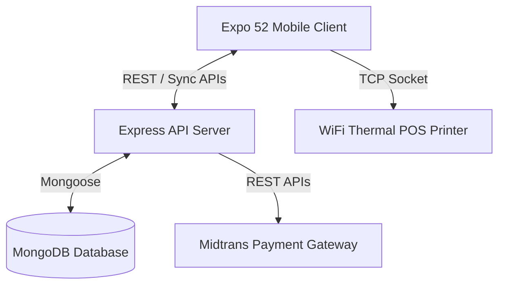

### Mobile Client (Expo)
* **React Native (0.76) & Expo (52)**: Multi-platform mobile app development.
* **Expo Router (V4)**: Typed file-based routing.
* **NativeWind (V4)**: High-performance React Native styling based on Tailwind utility classes.
* **TCP Socket (`react-native-tcp-socket`)**: Direct network communication with thermal POS printers.
* **AsyncStorage & NetInfo**: Local offline database cache and connectivity listeners.

### Backend Server
* **Express.js (Node.js)**: API Gateway handling sync engines, promo evaluations, and transaction pipelines.
* **Mongoose (MongoDB)**: Document database for catalogs, outlet allocations, vouchers, and transactions.
* **ESC/POS & Node Thermal Printer**: Server-side layout builders for receipt generation.
* **Midtrans Client**: Payment settlement integration.

---

## 🚀 Key Architectural Features

### 1. Offline-to-Online Sync Pipeline (`syncMobile`)
When network connectivity changes:
1. Mobile client tracks local sales registers and stock deductions in offline storage.
2. Once online, client initiates a sync process calling the backend `/api/v1/syncMobile` endpoints.
3. Backend resolves conflict checks, records transactions, and updates warehouse inventory balances.

<p align="center">
  
</p>

### 2. Network Thermal Printing
Utilizes direct socket connections to ESC/POS thermal printers. The app generates ESC/POS command buffers and streams them over TCP sockets (WiFi/Ethernet) directly to configured printer IP addresses in real-time.

### 3. Dynamic API Configuration
Since field agents work across different local subnets:
* The app features an administrative settings modal where users can type, test, and save custom backend URL endpoints.
* Saves configurations securely via `AsyncStorage` and `react-native-keychain` for autostart fallbacks.

### 4. Midtrans Payment Integration
Triggers instant payment requests to Midtrans server endpoints. Generates checkout links or QRIS payment codes displayed in-app, listening to webhook settlements to close open invoice bills automatically.

<p align="center">
  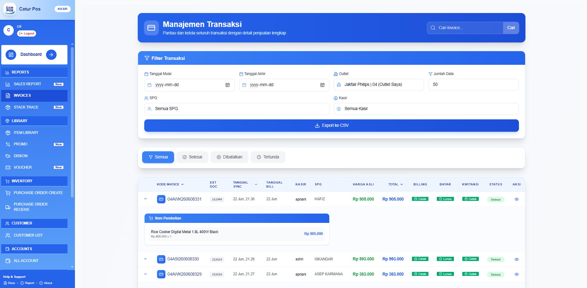
  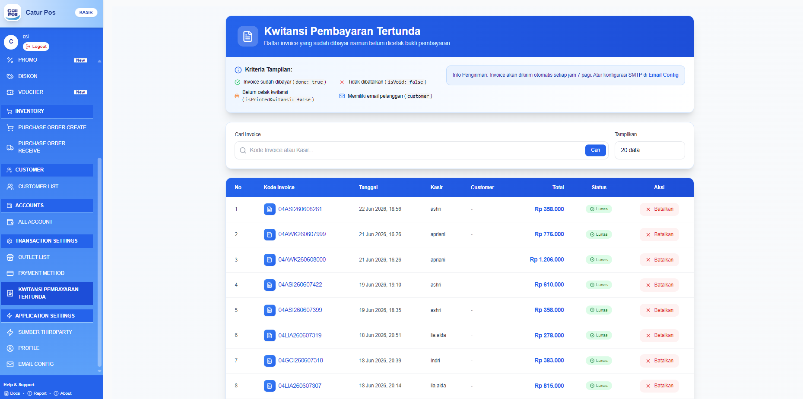
</p>

---

## 📸 Admin Dashboard & Operations Showcase

### 1. Promotional Rules & Vouchers
Configuring promotions, vouchers, and discounts in the POS web dashboard:
<p align="center">
  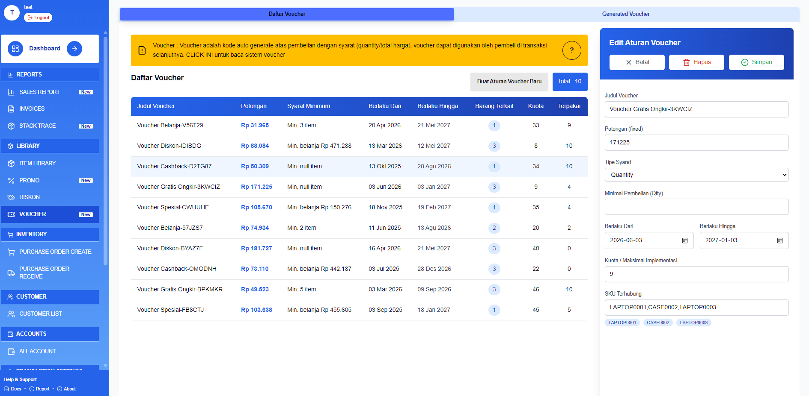
  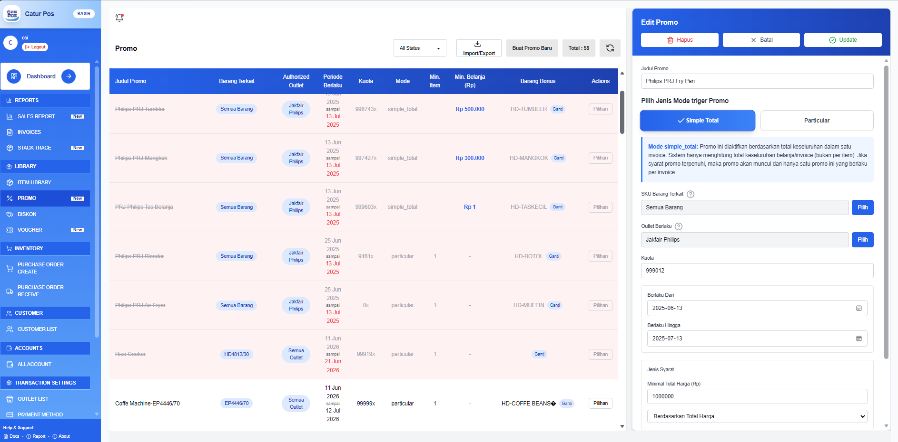
  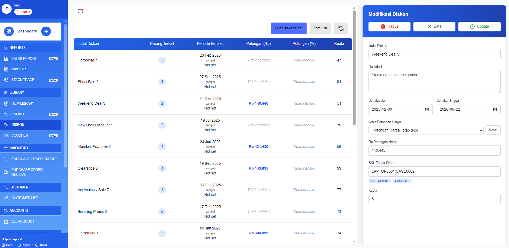
</p>

### 2. Purchase Orders (PO) Flow
Creating and receiving inventory POs:
<p align="center">
  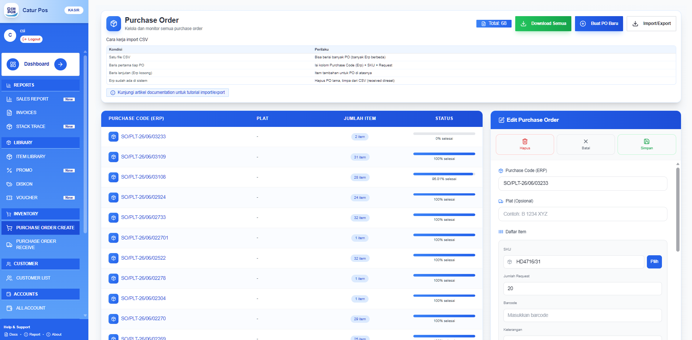
  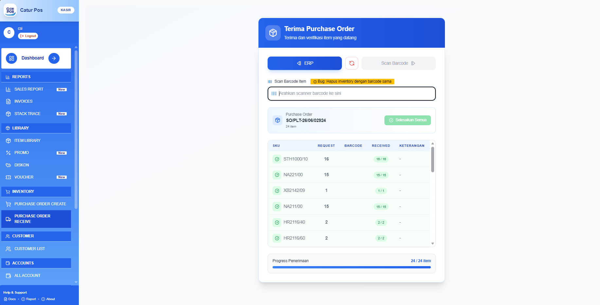
</p>

### 3. Master Data & Analytics
Managing database registers, accounts, product library catalog, and viewing sales reports:
<p align="center">
  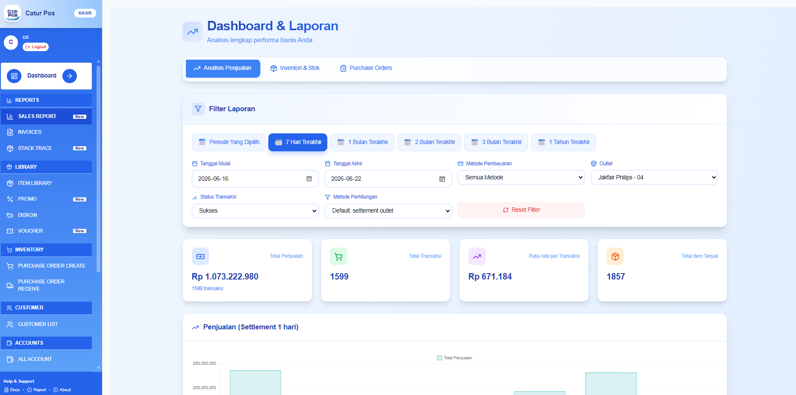
  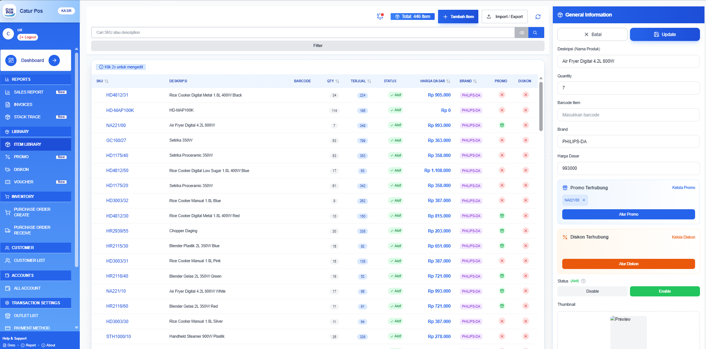
</p>

<p align="center">
  
  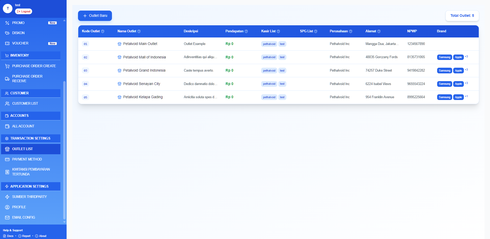
  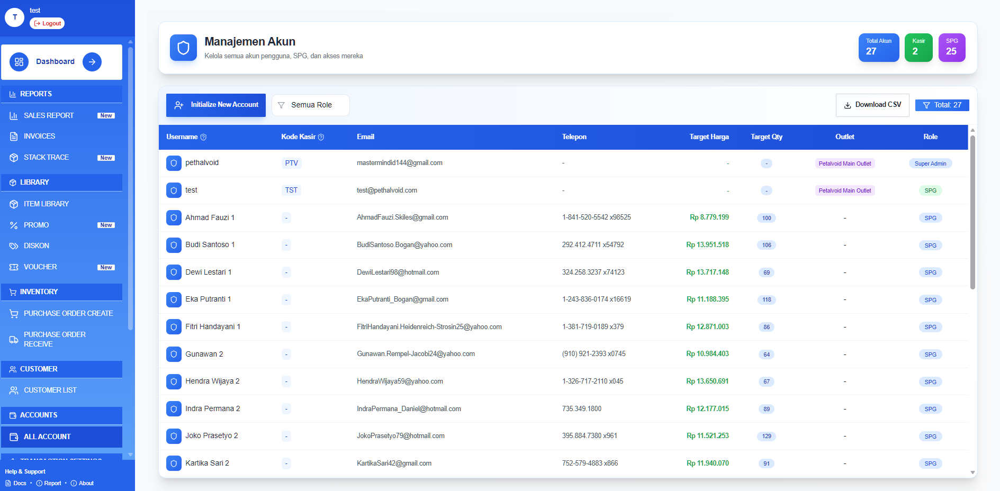
</p>

### 4. Technical Stack Trace Reports
Monitors mobile crashes and stack trace errors:
<p align="center">
  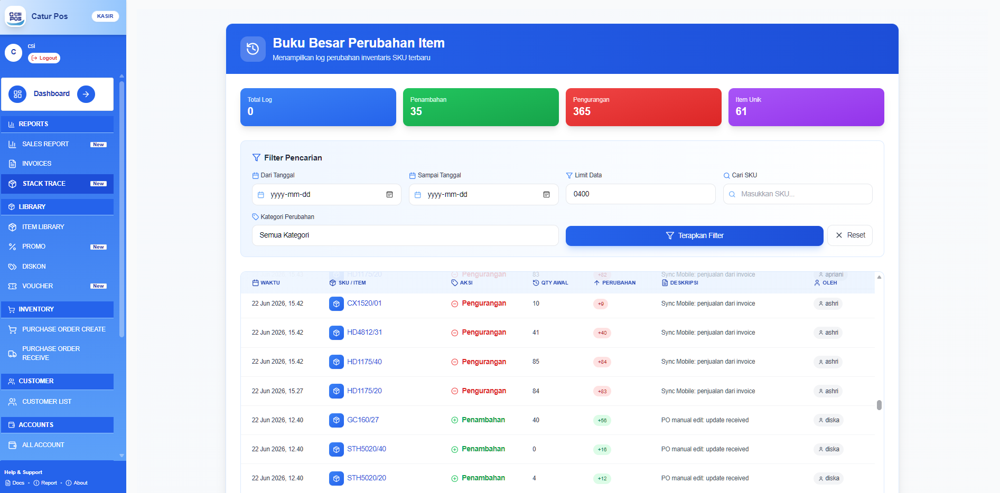
</p>

---

## ⚙️ Local Development Setup

### Backend Setup
1. Navigate to the backend directory:
   ```bash
   cd backend
   ```
2. Copy the environment template:
   ```bash
   cp .env.example .env
   ```
3. Install dependencies:
   ```bash
   pnpm install
   ```
4. Run seeds and start:
   ```bash
   pnpm run seed
   pnpm run dev
   ```

### Mobile Setup (Expo)
1. Navigate to the mobile directory:
   ```bash
   cd ../mobile
   ```
2. Install Expo and React Native dependencies:
   ```bash
   pnpm install
   ```
3. Start Expo:
   ```bash
   pnpm run android
   # or
   pnpm run ios
   ```
