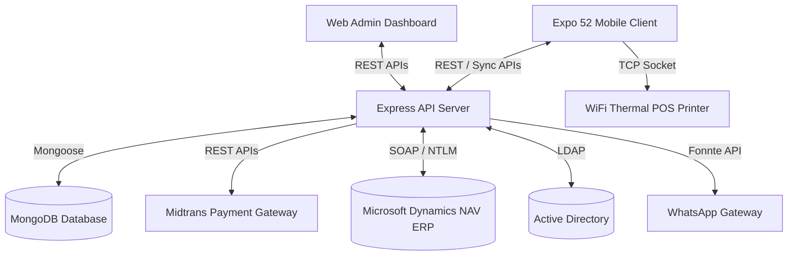
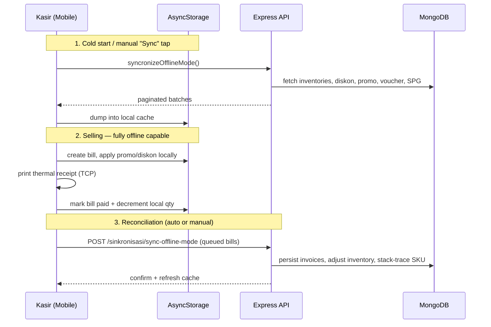
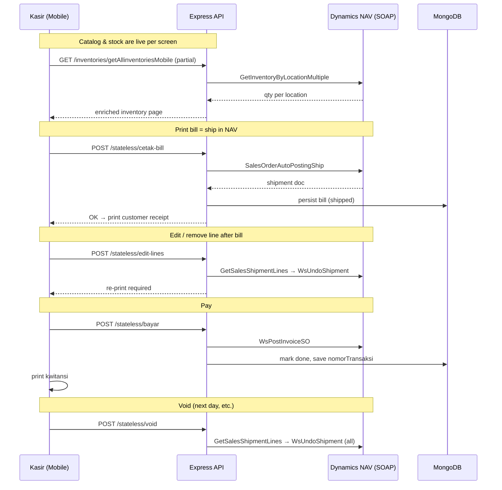
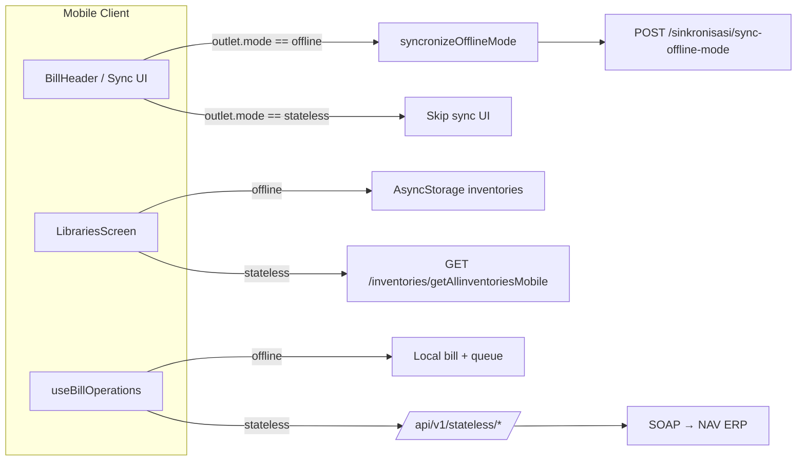

# Super POS Mobile

[](https://reactnative.dev/)
[](https://expo.dev/)
[](https://expressjs.com/)
[](https://www.mongodb.com/)
[](https://midtrans.com/) (indonesian STRIPE )

A high-performance, offline-first mobile Point of Sale (POS) application designed for sales representatives and retail outlet clerks, featuring local WiFi thermal printing and payment gateway integration.

<p align="center">
  
</p>

---

## 💼 Business Value & Real-World Impact

For mobile sales forces, field agents, or retail popups, internet connection drops shouldn't halt business. **Super POS Mobile** addresses this challenge by:
* **Offline-First Transactions**: Cashiers check out customers offline; transactions queue locally and sync automatically with the main office once a connection returns.
* **Direct Mobile Printing**: Sales reps print official invoices on-the-go to network/WiFi thermal printers directly from their phone.
* **Cashless Payments**: Accelerates checkouts using integrated Midtrans payment APIs (indonesian STRIPE) to process local electronic payments (QRIS, bank transfers, credit cards).
* **Flexible Promo Engine**: Evaluates active discount structures, item combos, and vouchers directly on the device.

---

## 🛠️ Tech Stack & Architecture



Super POS ships **three clients that talk to one Express backend**:
- **Mobile** — the field-facing POS (this app), tuned for offline resilience and NAV-backed stock.
- **Web Admin** — catalog, promo/voucher configuration, sales reports, RBAC, and system settings.
- **Backend** — API gateway, sync engine, SOAP↔NAV bridge, payment orchestration, LDAP auth, and receipt/WhatsApp delivery.

### Mobile Client (Expo)
* **React Native (0.76) & Expo (52)**: Multi-platform mobile app development.
* **Expo Router (V4)**: Typed file-based routing.
* **NativeWind (V4)**: High-performance React Native styling based on Tailwind utility classes.
* **TCP Socket (`react-native-tcp-socket`)**: Direct network communication with thermal POS printers.
* **AsyncStorage & NetInfo**: Local offline database cache and connectivity listeners.

### Backend Server
* **Express.js (Node.js)**: API Gateway handling sync engines, promo evaluations, and transaction pipelines.
* **Mongoose (MongoDB)**: Document database for catalogs, outlet allocations, vouchers, and transactions.
* **ESC/POS & Node Thermal Printer**: Server-side layout builders for receipt generation.
* **Midtrans Client**: Payment settlement integration. (indonesian stripe)

---

## 🚀 Key Architectural Features

### 1. Dual Outlet Modes: `offline` vs `stateless`

Every outlet is provisioned with an explicit `mode` (see `backend/models/Outlet.model.js`), and the mobile app switches its entire data-flow strategy based on that flag. This is the single most important architectural decision in the codebase — it lets one binary serve two very different retail realities:

| Aspect | `offline` mode | `stateless` mode |
|---|---|---|
| Intended use case | Event booths, pop-ups, unstable network locations | Permanent outlets integrated with the ERP warehouse |
| Source of truth for stock | Local `AsyncStorage` dump, reconciled on sync | **Microsoft Dynamics NAV** via SOAP (live) |
| Catalog fetch | Bulk paginated dump into `AsyncStorage` | Live partial fetch + infinite scroll per screen |
| Can sell without internet | **Yes** — transactions queue locally | **No** — cetak bill / bayar require connectivity |
| Sync engine | `syncronizeOfflineMode` → `/api/v1/sinkronisasi/sync-offline-mode` | Not used — every action hits NAV in real time |
| Bill endpoints | Local storage + sync mobile route | `/api/v1/stateless/{cetak-bill,edit-lines,bayar,void}` |
| Post-payment stock deduction | Local `updateInventoryAndStats` | Already reflected via NAV `WsPostInvoiceSO` |
| Discount below web price | Applied locally | Requires **pending approval** flow before shipment |
| Void flow | Local flag + sync | SOAP `GetSalesShipmentLines` → `WsUndoShipment` |

#### Offline mode — battle-tested sync pipeline



Offline mode is intentionally forgiving: the cashier never sees a spinner during checkout, and any connectivity blip is absorbed by the local queue.

#### Stateless mode — always-online NAV integration



Stateless mode trades offline capability for **inventory accuracy across the entire enterprise** — every sale, edit, and void is immediately reflected in the NAV warehouse, so head office reports and other outlets stay in sync without a nightly batch.

#### One codebase, two personas



The switch is driven by a single field on the outlet document, which means head office can migrate a booth from `offline` to `stateless` once permanent NAV connectivity is available — **no app reinstall required**.

### 2. Offline-to-Online Sync Pipeline (`syncMobile`) — offline mode only

When network connectivity changes on an outlet running in `offline` mode:
1. Mobile client tracks local sales registers and stock deductions in offline storage.
2. Once online, client initiates a sync process calling `POST /api/v1/sinkronisasi/sync-offline-mode`.
3. Backend resolves conflict checks, records transactions, and updates warehouse inventory balances.

Auto-sync respects an interval configured in `AsyncStorage.sinkronisasiInterval`, and is **skipped entirely for stateless outlets** since their state already lives on the server.

<p align="center">
  
</p>

### 3. Network Thermal Printing
Utilizes direct socket connections to ESC/POS thermal printers. The app generates ESC/POS command buffers and streams them over TCP sockets (WiFi/Ethernet) directly to configured printer IP addresses in real-time.

### 4. Dynamic API Configuration
Since field agents work across different local subnets:
* The app features an administrative settings modal where users can type, test, and save custom backend URL endpoints.
* Saves configurations securely via `AsyncStorage` and `react-native-keychain` for autostart fallbacks.

### 5. Midtrans Payment Integration
Triggers instant payment requests to Midtrans server endpoints. Generates checkout links or QRIS payment codes displayed in-app, listening to webhook settlements to close open invoice bills automatically.

### 6. Enterprise Auth & Messaging (Web Admin)
* **LDAP / Active Directory** — the same login field accepts both local app accounts and AD users. First LDAP login auto-provisions a `Kasir` (or `Super Admin` for `description == "IT"`), with a deny-list of admin pages configured centrally in `backend/constants/accessControl.js`.
* **Fonnte WhatsApp Gateway** — pending receipts (`/kwitansi_pembayaran_tertunda`) can be delivered directly to the customer's WhatsApp; token and tester UI live under `/whatsapp_config`.
* **Configurable AD / SMTP / WhatsApp** — all three integrations are editable at runtime from the Application Setting menu group; no redeploy needed to rotate credentials.

<p align="center">
  
  
</p>

---

## 📸 Admin Dashboard & Operations Showcase

### 1. Promotional Rules & Vouchers
Configuring promotions, vouchers, and discounts in the POS web dashboard:
<p align="center">
  
  
  
</p>

### 2. Purchase Orders (PO) Flow
Creating and receiving inventory POs:
<p align="center">
  
  
</p>

### 3. Master Data & Analytics
Managing database registers, accounts, product library catalog, and viewing sales reports:
<p align="center">
  
  
</p>

<p align="center">
  
  
  
</p>

### 4. Technical Stack Trace Reports
Monitors mobile crashes and stack trace errors:
<p align="center">
  
</p>

---

## ⚙️ Local Development Setup

### Backend Setup
1. Navigate to the backend directory:
   ```bash
   cd backend
   ```
2. Copy the environment template:
   ```bash
   cp .env.example .env
   ```
3. Install dependencies:
   ```bash
   pnpm install
   ```
4. Run seeds and start:
   ```bash
   pnpm run seed
   pnpm run dev
   ```

### Mobile Setup (Expo)
1. Navigate to the mobile directory:
   ```bash
   cd ../mobile
   ```
2. Install Expo and React Native dependencies:
   ```bash
   pnpm install
   ```
3. Start Expo:
   ```bash
   pnpm run android
   # or
   pnpm run ios
   ```
